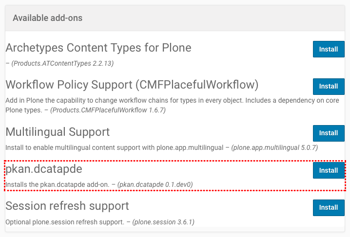
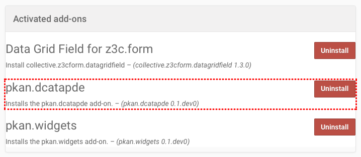

===================
Add-On Installation
===================

Install The Add-On
==================

You can install the Add-On like any other Plone Add-On:

#. Click on your username in the *personal tools menu* and select **Site Setup**
#. Click the **Add-Ons** item in the *General* section

You should see an item called **pkan.dcatapde**.
To install the add-on, click the **Install** button next to the add-on:

   Add-on in the list of available add-ons

Uninstall The Add-On
--------------------

You can uninstall the **pkan.dcatapde** add-on again from your Plone site by clicking the **Uninstall** button next to the add-on:

   Uninstall the add-on
